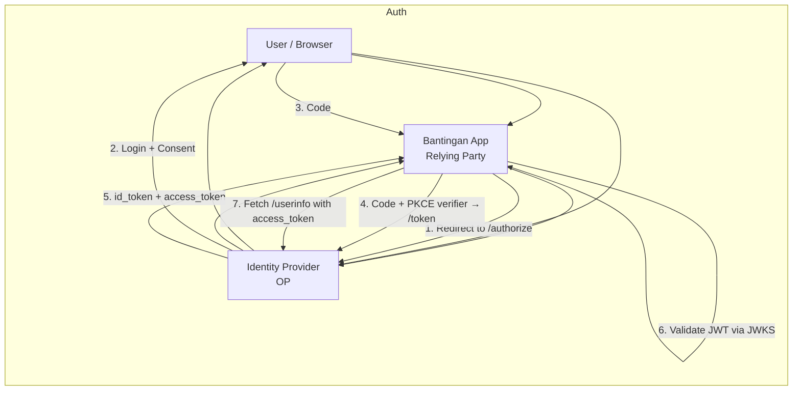
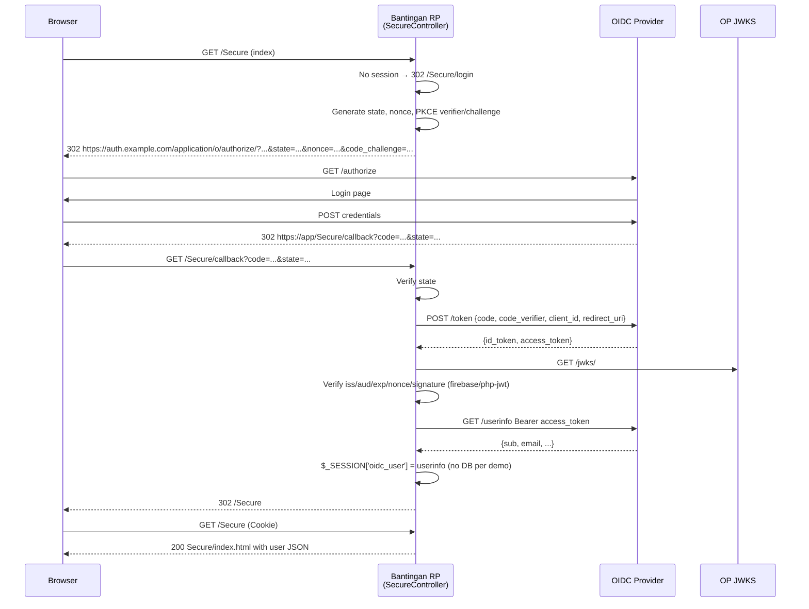
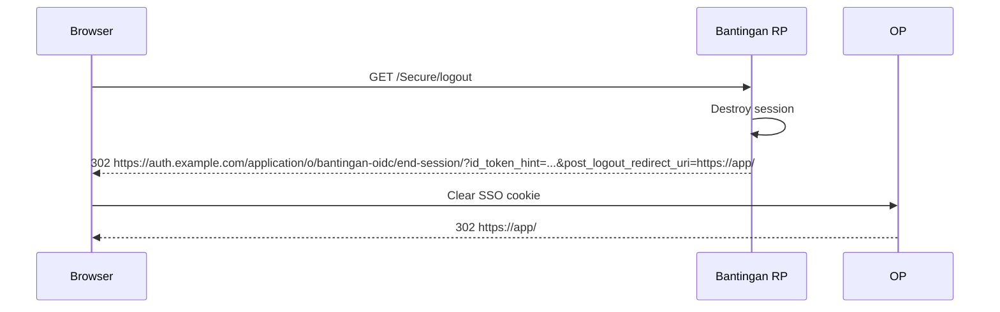

# Bantingan OIDC Demo

Demonstrate **OpenID Connect (OIDC)** implementation with the **Bantingan PHP Framework** (`susilon/bantingan` `dev-php8-update8.5`). A minimal, dockerized reference for plugging an OIDC Identity Provider (Authentik, Keycloak, Auth0, Azure AD, Google) into a Bantingan MVC app (FrankenPHP + Caddy).

> **Repo:** `susilon/bantingan-oidc` · **Framework:** [susilon/bantingan](https://github.com/susilon/bantingan) · **Stack:** PHP 8.5 / FrankenPHP / Caddy / MySQL / MongoDB / RedBeanPHP / Smarty / firebase/php-jwt

---

## Table of Contents

- [What is OIDC?](#what-is-oidc)
- [How the Flow Works](#how-the-flow-works)
- [Quick Start](#quick-start)
- [OIDC Configuration](#oidc-configuration)
- [Implemented Controllers](#implemented-controllers)
- [Security Notes](#security-notes)
- [Roadmap](#roadmap)
- [License](#license)

---

## What is OIDC?

**OpenID Connect (OIDC)** is an **identity layer on top of OAuth 2.0**. OAuth 2.0 handles *authorization* (access to APIs via access tokens); OIDC adds *authentication* — who the user is — via a standardized **ID Token (JWT)** and **UserInfo endpoint**.

| Concern | OAuth 2.0 | OIDC |
|---|---|---|
| Purpose | Delegated authorization | Authentication + identity |
| Token | `access_token` (opaque/JWT) | `id_token` (JWT, always) + `access_token` |
| Identity | No standard | `sub`, `email`, `name`, `groups` in JWT |
| Endpoint | `/authorize`, `/token` | Same + `/.well-known/openid-configuration`, `/userinfo` |
| SSO | No | Yes |

**Core artifacts:**

- **OP (OpenID Provider):** the IdP — Authentik, Keycloak, Auth0, Entra ID. Issues tokens.
- **RP (Relying Party):** this app — trusts the OP, validates tokens.
- **ID Token:** JWT with `iss`, `aud`, `sub`, `exp`, `nonce`. Signed by OP (JWKS).
- **Access Token:** for calling APIs / `userinfo`.
- **Refresh Token:** to renew without re-login.

OIDC keeps passwords out of your app — the RP never sees them.

---

## How the Flow Works

### 1. High-level



### 2. Authorization Code Flow with PKCE (this demo — `SecureController`)

PKCE prevents code interception; no client secret in browser.



### 3. Logout



Token validation uses `firebase/php-jwt` + `JWK::parseKeySet` against `jwks_uri`; never trust `iss`/`aud`/`exp`/`nonce` unchecked.

---

## Quick Start

### Prerequisites

- PHP 8.5 + Composer or Docker
- Authentik provider configured (issuer `https://auth.example.com/application/o/bantingan-oidc/`)

### 1. Docker (recommended)

```bash
cp config/database.config.yml.example config/database.config.yml
cp config/oidc.config.yml.example config/oidc.config.yml
# edit both — see OIDC Configuration below
docker build -t bantingan-oidc .
docker run -p 80:80 bantingan-oidc
open http://localhost/              # Home — public
open http://localhost/Secure      # → redirects to Authentik login
open http://localhost/Home/health # → ok
```

### 2. Local PHP

```bash
cp config/database.config.yml.example config/database.config.yml
cp config/oidc.config.yml.example config/oidc.config.yml
composer install
php -S localhost:8000
open http://localhost:8000/
open http://localhost:8000/Secure # → login first, then user JSON
```

---

## OIDC Configuration

`config/web.config.yml:load_settings` now loads `oidc_settings: oidc.config.yml` → `OIDC_SETTINGS` constant (`src/Settings.php:55`).

`config/oidc.config.yml` (gitignored, see `/.gitignore:28`):

```yaml
oidc:
  provider_url: https://auth.example.com/application/o/bantingan-oidc
  client_id: your-client-id
  client_secret: <secret> # use OIDC_CLIENT_SECRET env in prod
  redirect_uri: http://localhost:8000/Secure/callback  # or http://localhost/Secure/callback for Docker
  scopes: openid email profile
  post_logout_redirect_uri: http://localhost:8000/
  verify_jwt: true
```

**Provider notes (Authentik):**
- Discovery: `GET {provider_url}/.well-known/openid-configuration` → `200` with `authorization_endpoint`, `token_endpoint`, `jwks_uri`
- For Authentik the `provider_url` must include `/application/o/<app-slug>` (e.g. `https://auth.example.com/application/o/bantingan-oidc`), bare domain returns `404`
- `redirect_uri` must exactly match **Redirect URIs** in Provider settings (mismatch → `invalid redirect_uri`). Add both `http://localhost:8000/Secure/callback` and `http://localhost/Secure/callback` or use `BANTINGAN3_OIDC` env override.

---

## Implemented Controllers

**`HomeController` (`app/controllers/HomeController.php:14`) — public**
- `index()` → `$this->view()` → `app/views/Home/index.html`
- `health()` → `echo 'ok'`

**`SecureController` (`app/controllers/SecureController.php:1`) — protected OIDC**

| Method | Route | Behavior |
|---|---|---|
| `index()` | `GET /Secure` | Checks `$_SESSION['oidc_user']`, redirects to `login` if missing, else `viewBag->user/claims` → `app/views/Secure/index.html` (displays `userinfo` JSON, no DB persistence) |
| `login()` | `GET /Secure/login` | Discovers via `provider_url/.well-known/openid-configuration`, generates `state/nonce/PKCE verifier/challenge S256`, stores in session, `302` to `authorization_endpoint` |
| `callback()` | `GET /Secure/callback?code=&state=` | Validates `state`, POSTs to `token_endpoint` (`code_verifier`), verifies `id_token` via `firebase/php-jwt` + `JWK::parseKeySet(jwks_uri)`, checks `nonce`/`iss`/`aud`/`exp`, fetches `userinfo_endpoint` with `access_token`, stores `$_SESSION['oidc_user']` |
| `logout()` | `GET /Secure/logout` | Destroys session, `302` to `end_session_endpoint?id_token_hint=...&post_logout_redirect_uri=...` |

---

## Security Notes

- Validate `iss == provider_url`, `aud == client_id`, `exp` not expired, `nonce` matches.
- Cache discovery/JWKS 10 min (`$_SESSION`).
- Always `state` + `PKCE`; store server-side, not cookie.
- `verify_jwt: true` in prod; requires `firebase/php-jwt`.
- Secrets via `OIDC_CLIENT_SECRET` env or `BANTINGAN3_OIDC` JSON, never commit `config/oidc.config.yml`.

---

## Roadmap

- [x] `SecureController` with PKCE + discovery (Authentik)
- [x] JWKS validation + UserInfo (firebase/php-jwt)
- [x] Modern layout (sticky topbar, card, responsive)
- [x] Fix `curl_close()` deprecation, Smarty `{` spacing
- [ ] User sync to `usermanagement` DB (currently only display)
- [ ] Role/group mapping (`groups` claim → ACL)
- [ ] Front-channel logout + refresh token rotation
- [ ] Tests (PHPUnit) for callback

---

## License

MIT — see `vendor/susilon/bantingan/LICENSE`.
