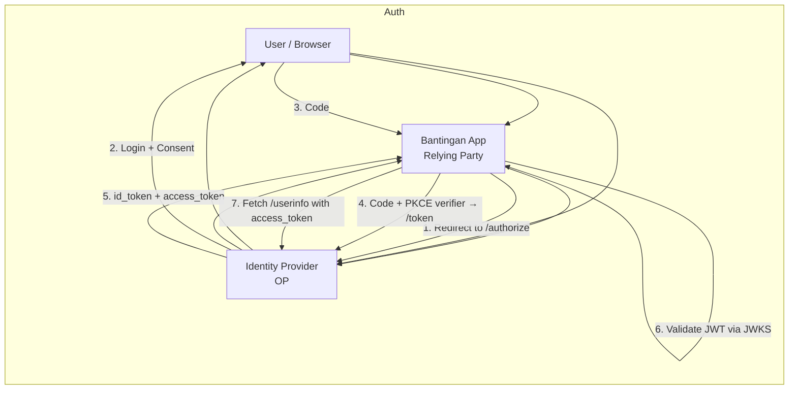
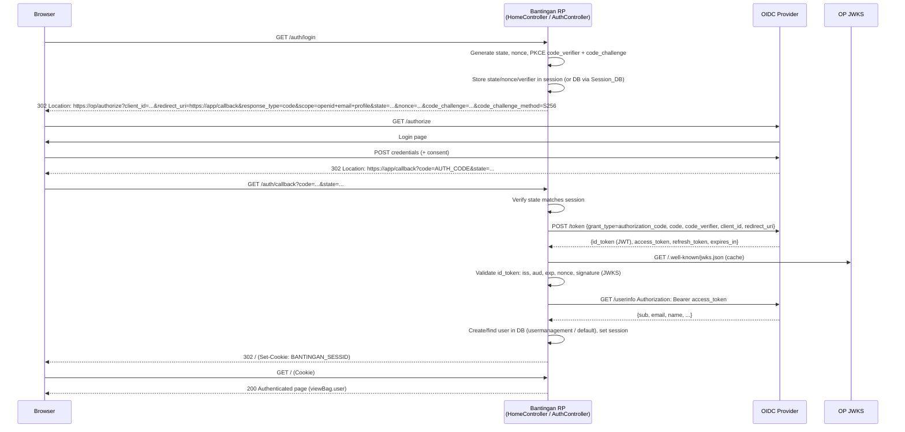
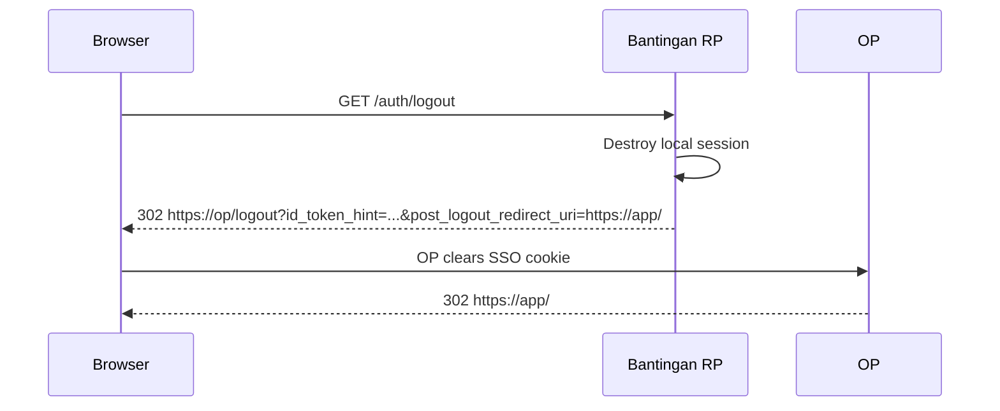

# Bantingan OIDC Demo

Demonstrate **OpenID Connect (OIDC)** implementation with the **Bantingan PHP Framework** (`susilon/bantingan` `dev-php8-update8.5`). A minimal, dockerized reference for plugging an OIDC Identity Provider (Keycloak, Auth0, Azure AD, Google) into a Bantingan MVC app (FrankenPHP + Caddy).

> **Repo:** `susilon/bantingan-oidc` · **Framework:** [susilon/bantingan](https://github.com/susilon/bantingan) · **Stack:** PHP 8.5 / FrankenPHP / Caddy / MySQL / MongoDB / RedBeanPHP / Smarty

---

## Table of Contents

- [What is OIDC?](#what-is-oidc)
- [How the Flow Works](#how-the-flow-works)
- [Tech Stack](#tech-stack)
- [Quick Start](#quick-start)
- [Implementing OIDC in Bantingan](#implementing-oidc-in-bantingan)
- [Security Notes](#security-notes)
- [Roadmap](#roadmap)
- [License](#license)

---

## What is OIDC?

**OpenID Connect (OIDC)** is an **identity layer on top of OAuth 2.0**. OAuth 2.0 handles *authorization* (access to APIs via access tokens); OIDC adds *authentication* — who the user is — via a standardized **ID Token (JWT)** and **UserInfo endpoint**.

| Concern | OAuth 2.0 | OIDC |
|---|---|---|
| Purpose | Delegated authorization | Authentication + identity |
| Token | `access_token` (opaque/JWT) | `id_token` (JWT, always) + `access_token` |
| Identity | No standard | `sub`, `email`, `name`, `groups` in JWT |
| Endpoint | `/authorize`, `/token` | Same + `/.well-known/openid-configuration`, `/userinfo` |
| SSO | No | Yes |

**Core artifacts:**

- **OP (OpenID Provider):** the IdP — Keycloak, Auth0, Entra ID. Issues tokens.
- **RP (Relying Party):** this app — trusts the OP, validates tokens.
- **ID Token:** JWT with `iss`, `aud`, `sub`, `exp`, `nonce`. Signed by OP (JWKS).
- **Access Token:** for calling APIs / `userinfo`.
- **Refresh Token:** to renew without re-login.

OIDC keeps passwords out of your app — the RP never sees them.

---

## How the Flow Works

### 1. High-level



### 2. Authorization Code Flow with PKCE (recommended — this demo)

The only flow you should use for web apps. No client secret in browser; PKCE prevents code interception.



### 3. Logout



**Token validation in Bantingan** will use `firebase/php-jwt` or `jumbojett/openid-connect-php` against `jwks_uri` from discovery; never trust the JWT without signature + `iss`/`aud`/`exp`/`nonce` checks.

---

## Tech Stack

| Layer | Choice |
|---|---|
| Framework | `susilon/bantingan` `dev-php8-update8.5` (MVC, Smarty, Symfony Routing) |
| Runtime | FrankenPHP 1 + Caddy |
| Language | PHP 8.5 |
| ORM | `gabordemooij/redbean` |
| Auth lib (planned) | `jumbojett/openid-connect-php` or `firebase/php-jwt` + `guzzlehttp/guzzle` |
| DB | MySQL (default), MongoDB |
| Template | Smarty 4 |
| Docker | `dunglas/frankenphp:1-php8.5` |

---

## Quick Start

### Prerequisites

- PHP 8.5 + Composer, or Docker
- An OIDC provider (Keycloak locally, or Auth0/Entra ID). For pure scaffolding the app runs without OIDC.

### 1. Docker (recommended)

```bash
cp config/database.config.yml.example config/database.config.yml
# edit config/database.config.yml and config/web.config.yml as needed

docker build -t bantingan-oidc .
docker run -p 80:80 bantingan-oidc
# or with docker compose (if you add compose.yml)

open http://localhost/
open http://localhost/Home/health  # -> ok
```

### 2. Local PHP

```bash
cp config/database.config.yml.example config/database.config.yml
composer install
php -S localhost:8000
open http://localhost:8000/
```

### 3. Skills (optional)

Canonical source is `skills/`. Symlinks are already set up for Claude/Codex/Opencode/Agents. On Windows:

```bash
./scripts/sync-skills.sh
```

---

## Implementing OIDC in Bantingan

> Current `app/controllers/HomeController.php:14` is a scaffold. Below is the intended OIDC integration — copy as `app/controllers/AuthController.php`.

#### 1. Install OIDC client

```bash
composer require jumbojett/openid-connect-php firebase/php-jwt guzzlehttp/guzzle
```

#### 2. Add config (`config/oidc.config.yml` + wire in `web.config.yml:load_settings`)

```yaml
oidc:
  provider_url: https://keycloak.example.com/realms/demo
  client_id: bantingan-oidc
  client_secret: ${OIDC_CLIENT_SECRET}
  redirect_url: https://app.example.com/auth/callback
  scopes: openid email profile
  post_logout_redirect: https://app.example.com/
```

#### 3. Controller sketch

```php
<?php
namespace Controllers;

use Bantingan\Controller;
use Jumbojett\OpenIDConnectClient;

class AuthController extends Controller
{
    private function oidc(): OpenIDConnectClient
    {
        $c = OIDC_SETTINGS; // loaded via Settings::LoadFromPath
        $oidc = new OpenIDConnectClient($c['provider_url'], $c['client_id'], $c['client_secret']);
        $oidc->setRedirectURL($c['redirect_url']);
        $oidc->addScope($c['scopes']);
        $oidc->setResponseTypes(['code']);
        $oidc->usePKCE();
        return $oidc;
    }

    public function login()
    {
        $oidc = $this->oidc();
        // state/nonce/PKCE handled by library; stored in session
        $oidc->authenticate();
    }

    public function callback()
    {
        $oidc = $this->oidc();
        $oidc->authenticate(); // validates code, state, nonce

        $claims = $oidc->getVerifiedClaims(); // id_token payload
        // Validate iss/aud/exp already done; optionally re-validate with firebase/php-jwt + JWKS

        // Upsert user into usermanagement DB
        $user = new \Models\UserModel();
        $user->selectedDB = 'usermanagement';
        $bean = $user->findOrCreate(['sub' => $claims->sub]);
        $bean->email = $claims->email;
        $bean->name  = $claims->name ?? $claims->preferred_username;
        $user->save($bean);

        $_SESSION['user'] = (array)$claims;
        $_SESSION['id_token'] = $oidc->getIdToken();
        $this->redirect('/');
    }

    public function logout()
    {
        $idToken = $_SESSION['id_token'] ?? null;
        session_destroy();
        $oidc = $this->oidc();
        $oidc->signOut($idToken, OIDC_SETTINGS['post_logout_redirect']);
    }
}
```

#### 4. Protect routes

In a base controller or middleware:

```php
protected function requireAuth()
{
    if (empty($_SESSION['user'])) {
        $this->redirect('/auth/login');
    }
}
```

#### 5. Views

Set `$this->viewBag->user = $_SESSION['user']` and render in `app/views/Shared/layout.html`:

```smarty
{if $user}
  <span>{$user.email}</span> <a href="/auth/logout">Logout</a>
{else}
  <a href="/auth/login">Login with OIDC</a>
{/if}
```

---

## Security Notes

- **Validate every field:** `iss` matches `provider_url`, `aud` == `client_id`, `exp` not expired, `nonce` matches session.
- **JWKS caching:** Cache `/.well-known/openid-configuration` and `jwks_uri` for 10–60 min.
- **State + PKCE:** Always use both; store `state`/`nonce`/`code_verifier` in server session, not cookie.
- **HTTPS only:** OIDC `redirect_uri` must be HTTPS in production.
- **Session:** Consider `APPLICATION_SETTINGS.Session_DB=true` with `Modules\Common\Session\MongoSession` (`index.php:10`) for clustered deployments.
- **Secrets:** Keep `client_secret` in `.env` or `BANTINGAN3_OIDC` env, never in `database.config.yml.example`.

---

## Roadmap

- [ ] `AuthController` with PKCE + discovery
- [ ] JWKS validation + UserInfo
- [ ] User sync to `usermanagement` DB
- [ ] Role/group mapping (`groups` claim → Bantingan ACL)
- [ ] Front-channel logout + refresh token rotation
- [ ] Tests (PHPUnit) for callback validation

---

## License

MIT — see `vendor/susilon/bantingan/LICENSE`.
